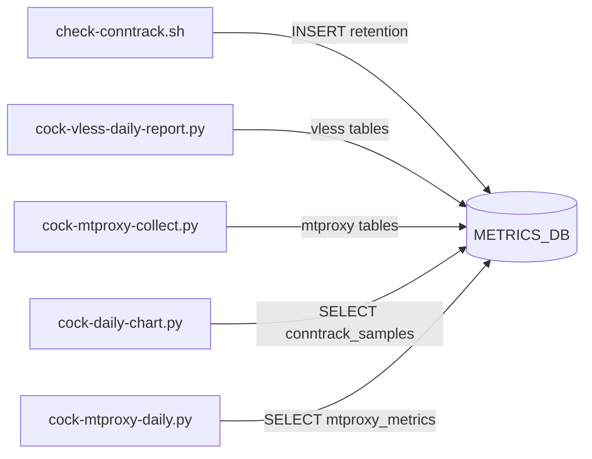

# Этап 0 — инвентаризация и контракты на бумаге

Результат **Этапа 0** плана рефакторинга: публичные сценарии, входы/выходы, таймеры и схема [`METRICS_DB`](../config.example.env). Источники: [`README.md`](../README.md), [`config.example.env`](../config.example.env), `bin/*`, [`mtproxy_module/core.py`](../mtproxy_module/core.py).

**Вне области продукта:** DDL в `migration/source-configs/` — артефакты миграции сервера, не путать с текущим `METRICS_DB` в runtime.

---

## 1. Матрица сценариев

| Сценарий | Entrypoint | Основные входы (env / CLI) | Выходы | systemd timer |
|----------|------------|----------------------------|--------|-----------------|
| Conntrack fill + stats + метрики + LA | [`bin/check-conntrack.sh`](../bin/check-conntrack.sh) | Путь к `.env` argv или `ENV_FILE`; см. `WARN_PERCENT`, `CRIT_PERCENT`, `COOLDOWN_SECONDS`, `STATE_FILE`, `CHECK_CONNTRACK_FILL`, `ALERT_ON_STATS*`, `METRICS_*`, `LA_ALERT_*`, `DRY_RUN` / `--dry-run` | Telegram (`sendMessage`); при записи метрик — SQLite [`METRICS_DB`](../config.example.env); state-файл [`STATE_FILE`](../config.example.env) | [`systemd/cock-monitor.timer`](../systemd/cock-monitor.timer) → [`cock-monitor.service`](../systemd/cock-monitor.service) |
| Ручной полный статус | [`bin/cock-status.sh`](../bin/cock-status.sh) | `.env` | stdout (текст); читает те же источники, что и мониторинг | нет (ручной / вызов из бота) |
| Суточный PNG conntrack | [`bin/cock-daily-chart.py`](../bin/cock-daily-chart.py) | `--env-file`, `--output`, `--send-telegram`, `--hours`; `METRICS_DB`, `DAILY_CHART_HOURS`, `TELEGRAM_*` | PNG; опционально Telegram `sendPhoto`; **читает** `conntrack_samples` | [`cock-monitor-daily.timer`](../systemd/cock-monitor-daily.timer) (00:05) → [`cock-monitor-daily.service`](../systemd/cock-monitor-daily.service) |
| VLESS daily / delta | [`bin/cock-vless-daily-report.py`](../bin/cock-vless-daily-report.py) | `--env-file`, `--dry-run`, `--send-telegram`, `--mode daily` или `since-last-sent`; `XUI_DB_PATH`, `METRICS_DB`, `VLESS_*`, `TELEGRAM_*` | Telegram; **запись** в `METRICS_DB` (таблицы vless*); **чтение** внешней БД 3x-ui (`client_traffics` и др.) | [`cock-vless-daily.timer`](../systemd/cock-vless-daily.timer) → [`cock-vless-daily.service`](../systemd/cock-vless-daily.service) |
| MTProxy collect | [`bin/cock-mtproxy-collect.py`](../bin/cock-mtproxy-collect.py) | `--env-file`; `MTPROXY_*`, `METRICS_DB`, `TELEGRAM_*` | Telegram при алертах; **запись** mtproxy* в `METRICS_DB` | [`cock-mtproxy-monitor.timer`](../systemd/cock-mtproxy-monitor.timer) → [`cock-mtproxy-monitor.service`](../systemd/cock-mtproxy-monitor.service) |
| MTProxy daily chart | [`bin/cock-mtproxy-daily.py`](../bin/cock-mtproxy-daily.py) | `--env-file`, `--hours`, `--send-telegram` | PNG + Telegram; читает `mtproxy_metrics` | [`cock-mtproxy-daily.timer`](../systemd/cock-mtproxy-daily.timer) → [`cock-mtproxy-daily.service`](../systemd/cock-mtproxy-daily.service) |
| CPU shaper | [`bin/cock-cpu-shaper.sh`](../bin/cock-cpu-shaper.sh) | `.env`; `SHAPER_*`, `TELEGRAM_*` | [`SHAPER_STATUS_FILE`](../config.example.env) / [`SHAPER_STATE_FILE`](../config.example.env); опционально Telegram | [`cock-shaper.timer`](../systemd/cock-shaper.timer) → [`cock-shaper.service`](../systemd/cock-shaper.service) |
| Incident sampler | [`bin/incident-sampler.sh`](../bin/incident-sampler.sh) | `INCIDENT_*`, `TELEGRAM_*` | JSONL `incident-YYYYMMDD.jsonl` в [`INCIDENT_LOG_DIR`](../config.example.env); state [`INCIDENT_STATE_FILE`](../config.example.env); опционально Telegram | [`cock-monitor-incident-sampler.timer`](../systemd/cock-monitor-incident-sampler.timer) → [`cock-monitor-incident-sampler.service`](../systemd/cock-monitor-incident-sampler.service) |
| Post-mortem | [`bin/incident-postmortem.py`](../bin/incident-postmortem.py) | CLI (stdin/файлы, `INCIDENT_LOG_DIR` из окружения при вызове из sampler) | HTML на stdout/файл; **не** `METRICS_DB` | вызывается из логики sampler/recovery (не отдельный timer в списке unit-ов) |
| Telegram poll (команды) | `python3 -m telegram_bot --poll-once` | [`telegram_bot/`](../telegram_bot/), env-файл; `COCK_MONITOR_HOME`, `PYTHONPATH` | Telegram; `/chart` и `/vless_delta` сейчас через [`subprocess.run`](../telegram_bot/handlers.py) к `cock-daily-chart.py` и `cock-vless-daily-report.py`; `/status` → [`cock-status.sh`](../telegram_bot/status_provider.py) | [`cock-monitor-telegram-bot.timer`](../systemd/cock-monitor-telegram-bot.timer) → [`cock-monitor-telegram-bot.service`](../systemd/cock-monitor-telegram-bot.service) |

---

## 2. Поток данных по `METRICS_DB` (сводка)

---

## 3. Таблицы и ключевые колонки в `METRICS_DB`

Источник DDL в коде: **`conntrack_samples` / `host_samples`** — миграции [`cock_monitor/storage/migrations_conntrack_host.py`](../cock_monitor/storage/migrations_conntrack_host.py) (вызываются из [`bin/check-conntrack.sh`](../bin/check-conntrack.sh) через `python3 -m cock_monitor conntrack-storage`); VLESS — [`bin/cock-vless-daily-report.py`](../bin/cock-vless-daily-report.py) `ensure_report_tables`; MTProxy — [`mtproxy_module/core.py`](../mtproxy_module/core.py) `init_schema`.

| Таблица | Назначение | Ключевые колонки |
|---------|------------|------------------|
| `conntrack_samples` | История nf_conntrack + суммы/дельты `conntrack -S` | `ts`, `fill_pct`, `fill_count`, `fill_max`, `drop`, `insert_failed`, `early_drop`, `error`, `invalid`, `search_restart`, `interval_sec`, `delta_*` |
| `host_samples` | Пара к `conntrack_samples` по `ts`: load, mem, TCP sockstat, шейпер, tc | `ts`, `load1`, `mem_avail_kb`, `swap_used_kb`, `tcp_*`, `shaper_rate_mbit`, `shaper_cpu_pct`, `tc_qdisc_root` |
| `vless_daily_snapshots` | Снимок трафика по email за календарный день MSK | PK `(snapshot_day_msk, email)`, `ts`, `up_bytes`, `down_bytes`, `total_bytes` |
| `vless_daily_reports` | Агрегат суточного отчёта + факт отправки | `snapshot_day_msk`, `ts`, `total_clients`, `total_delta_bytes`, `top1_*`, `sent_ok` |
| `vless_report_checkpoints` | Контрольные точки для since-last-sent | PK `(ts, email)`, `total_bytes`, `source` |
| `mtproxy_metrics` | Срезы MTProxy | `ts`, `total_connections`, `unique_ips`, `bytes_in`, `bytes_out`, `top_ips_json` |
| `mtproxy_alerts` | История алертов | `ts`, `alert_type`, `alert_key`, `message` |
| `mtproxy_state` | KV-состояние (в т.ч. пороги из `/mt_threshold`) | `key`, `value` |
| `mtproxy_ip_geo_cache` | Кэш geo по IP | `ip`, `data`, `ts` |

**Вне `METRICS_DB` (но важно для VLESS):** read-only [`XUI_DB_PATH`](../config.example.env) — таблица `client_traffics` (и др. схема 3x-ui), не создаётся скриптами cock-monitor.

---

## 4. Прочие персистентные контракты (не SQLite)

- **`STATE_FILE`** — cooldown fill/stats/LA ([`bin/check-conntrack.sh`](../bin/check-conntrack.sh)).
- **`INCIDENT_*`** — JSONL + `INCIDENT_STATE_FILE` ([`lib/incident-metrics.sh`](../lib/incident-metrics.sh), [`config.example.env`](../config.example.env)).
- **`SHAPER_*_FILE`** — состояние/статус шейпера, потребляется `check-conntrack` для контекста в алертах и `host_samples`.

---

## 5. Явные контракты для следующих этапов рефакторинга

- Один файл БД — **общая точка связности**; DDL размазан по `check-conntrack.sh`, `cock-vless-daily-report.py`, `mtproxy_module/core.py` — технический долг для этапов 3+.
- **Telegram bot:** [`handlers.py`](../telegram_bot/handlers.py) — `subprocess` для `/chart` и `/vless_delta` (этап 5 рефакторинга).
